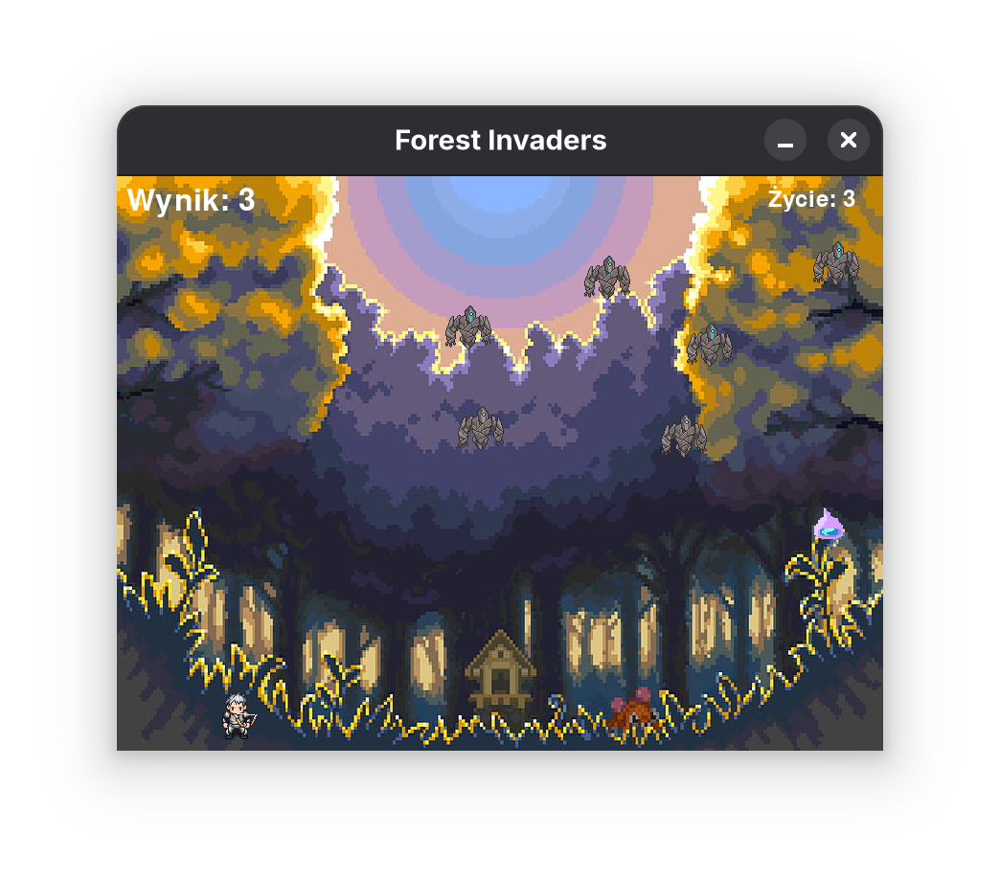

# Forest Invaders

**Forest Invaders** is a simple, amateur project created as my first Python game. The goal of the game is to defend the forest from invading enemies. This project was made to learn the basics of Python and game development.

## Features

- Basic game mechanics
- Simple graphics
- Score tracking

## How to Run

Make sure you have Python and Pygame installed.  
You also need the `pygame` library. Install it with:
```bash
pip install pygame
```
To start the game, open your terminal in the project folder and run:
```bash
python forest_invaders.py
```

## Note

This is a beginner-level, amateur project. Feel free to expand it and develop more advanced game mechanics, graphics and features.